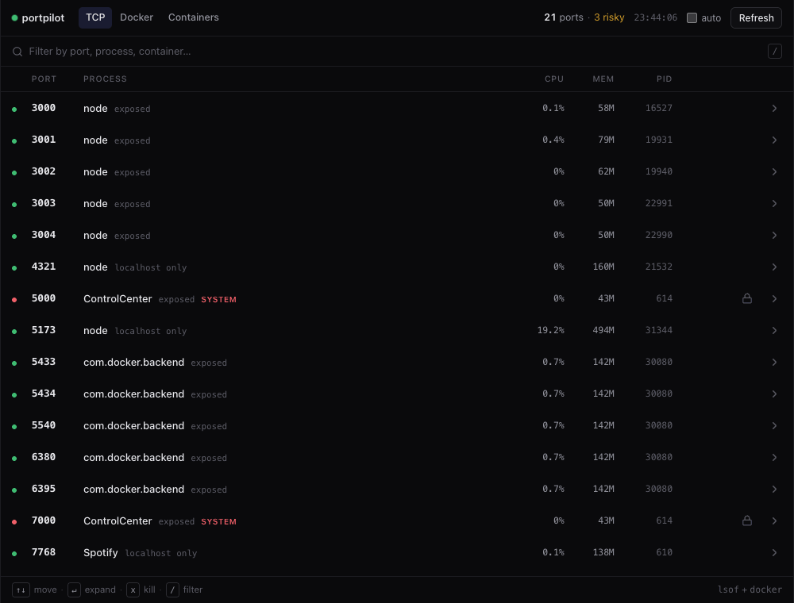
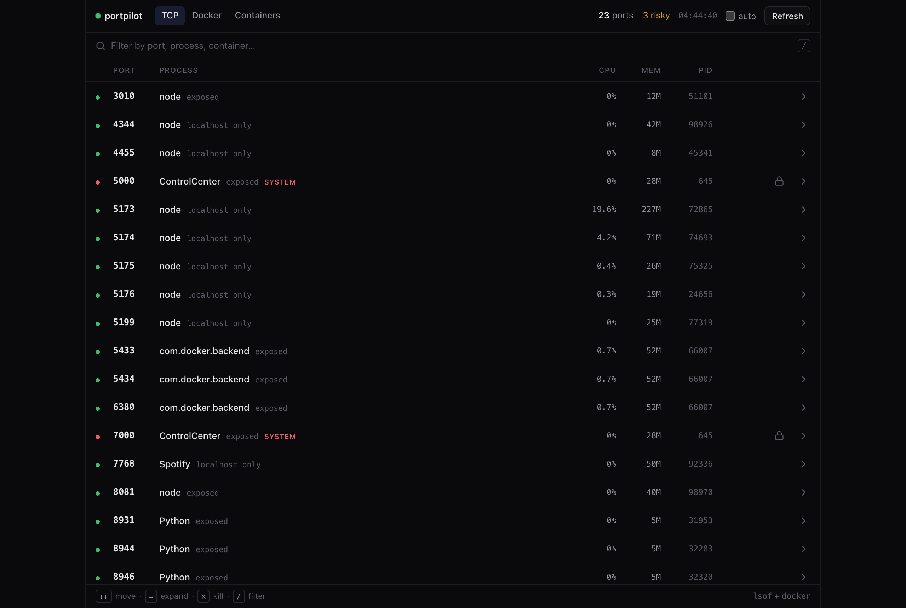
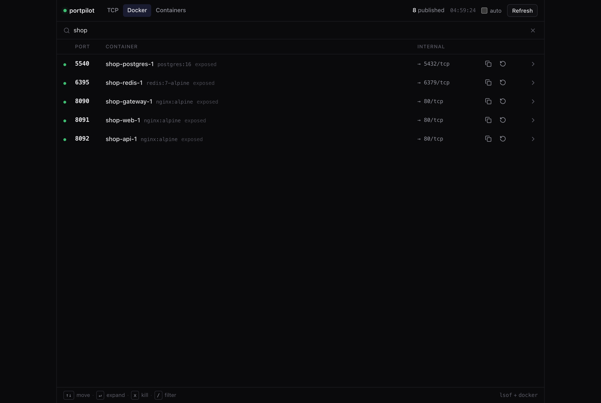
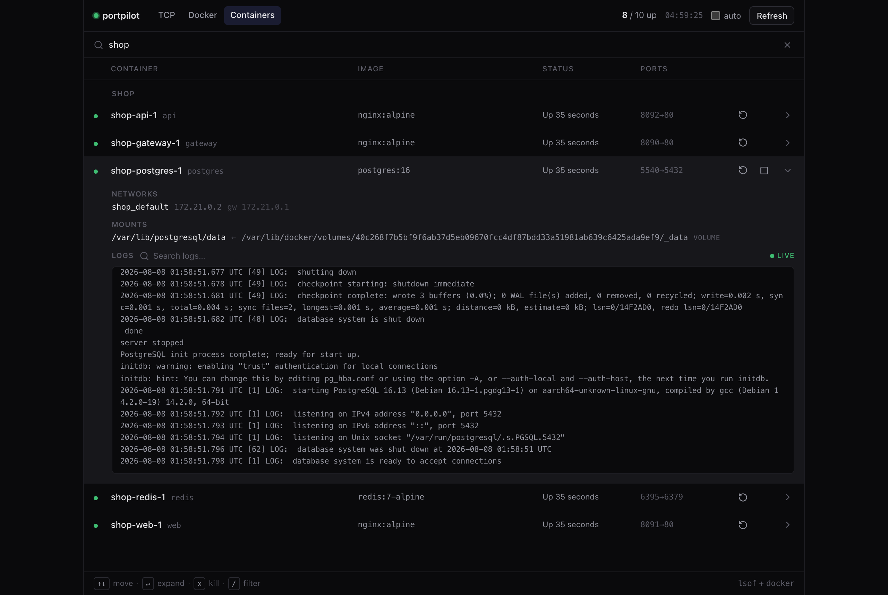

# deport

**deport** is a fast, keyboard-driven local dashboard for everything running on your machine. It lists the **TCP ports** in use and the **Docker containers** behind them side by side — with live CPU and memory — and lets you act right from the list: kill the process on a port, stop / restart a container, or tail its logs. Anything dangerous to touch is locked.

Three switchable views — **TCP ports**, **Docker ports** and **Containers** (start/stop/restart, live logs, inspect) — all in one clean, dense layout. Built as a single [SvelteKit](https://kit.svelte.dev) app: the browser renders the UI while server endpoints run `lsof` / `ps` / `docker` and send the kill signal. One codebase, full-stack.



## Why

Every developer hits this: a dev server crashes but keeps the port, or you forget what's already running on `3000`. The usual fix is a half-remembered `lsof -ti:3000 | xargs kill -9`. deport turns that into a readable list you can act on.

## Features

- **Three views, one switch** — flip between the machine's **TCP ports**, **Docker's published ports** and the **Containers** list, rendered identically.
- **Dense, monitor-style list** — port, process, live **CPU %**, memory, PID and bind scope (`localhost` vs. exposed to the network), with tabular monospace numerals.
- **Filter and drive it from the keyboard** — `/` to filter as you type, `↑↓` / `j` `k` to move, `↵` to expand, `x` to kill.
- **Expand any row** for live technical details — a TCP process shows CPU %, resident memory, uptime, parent PID and its full command line; a container shows CPU, memory, network and disk I/O, and process count. Fetched on demand when you open the row.
- **Docker port map** — every running container's `host → container` port mapping, with image and scope; **copy** the `localhost:port` or **restart** the owner right from the row.
- **Containers view** — a third tab listing every container (running + stopped), grouped by Compose project, with image, status + health + age and published ports. **Start / stop / restart** each one, and expand a row for its **networks, mounts and restart policy** (from `docker inspect`) plus a **live log stream** (`docker logs -f` over Server-Sent Events) with a green *live* indicator and **in-panel search** that highlights matches.
- **Stop a container** — free a Docker-held port straight from the list with `docker stop` (graceful), behind the same confirm step.
- **Risk warnings** — flags processes that are dangerous to kill with a `system` / `caution` marker, an accent bar and a header count. Known system daemons (`ControlCenter`, `rapportd`, …) are **protected**: the kill action is replaced by a lock so you can't take them down by accident. Privileged ports (below 1024) and root- or other-user-owned processes are marked `caution`.
- **One-click kill** with an inline confirm step, so nothing dies by accident.
- **Graceful by default** — the confirm button sends `SIGTERM`; a separate `force` action sends `SIGKILL` only when you mean it.
- **Tooltips** on every action, **auto-refresh** toggle, graceful "Docker not running" handling, light & dark, keyboard-focusable, no external UI dependencies.

## Screenshots

**TCP ports** — every listening port with live CPU and memory, bind scope, PID, and a lock on protected system processes:



**Docker ports** — every running container's published `host → container` mapping, with image and bind scope; copy the `localhost:port` or restart the owner inline:



**Containers** — grouped by Compose project, with a row expanded to show `docker inspect` metadata (networks, mounts) and a live `docker logs -f` stream with in-panel search:



> The Docker and Containers views — here and in the demo above — use a throwaway `shop` demo stack.

## How it works

```
Browser (Svelte UI)  ──fetch──▶  SvelteKit server endpoints  ──▶  OS
   +page.svelte                   /api/ports              → lsof / ss / netstat
                                  /api/kill               → process.kill(pid, signal)
                                  /api/docker             → docker ps / start / stop / restart
                                  /api/process            → ps  (per-process details)
                                  /api/docker/stats       → docker stats
                                  /api/docker/inspect     → docker inspect (networks, mounts)
   EventSource  ◀──SSE stream──   /api/docker/logs/stream → docker logs -f
```

Listing ports comes down to reading the kernel's open-file table via `lsof`:

```bash
lsof -nP +c0 -iTCP -sTCP:LISTEN -FpcnL
```

- `-nP` — numeric addresses and ports (no slow DNS / service-name lookups)
- `-iTCP -sTCP:LISTEN` — only TCP sockets in the `LISTEN` state
- `-FpcnL` — machine-readable output (pid, command, name, login)

Killing a port is really killing the process that holds it. `SIGTERM` asks it to shut down cleanly and release the port; `SIGKILL` (`-9`) forces the kernel to remove it immediately, with no cleanup — a last resort. The server uses Node's `process.kill(pid, signal)` directly, so there is no shell string to inject into.

The Docker view reads `docker ps --format '{{json .}}'` and parses each container's published mappings (`0.0.0.0:5432->5432/tcp`) into the same shape as a TCP port, so both lists render through one component. Stopping a container runs `docker stop` (SIGTERM, then SIGKILL after a grace period). Commands are run via `execFile` (no shell), and container ids are validated before use.

**Live logs use Server-Sent Events, not WebSockets.** The stream is one-way (server → browser), so `/api/docker/logs/stream` returns a `ReadableStream` with `content-type: text/event-stream` that pipes a `docker logs -f` child process, and the client consumes it with the browser's native `EventSource`. It's plain HTTP (no upgrade handshake, proxy-friendly), and the child process is killed the moment the client disconnects — every stream write is guarded so a vanished client can't crash the server.

Each TCP listener is also given a **risk rating** on the server: known system daemons, ports below 1024, and processes owned by `root` or another user are marked `system` / `caution` so the kill action carries a visible warning instead of treating every process as equally safe.

## Engineering notes

A few decisions that went into it:

- **Live logs over SSE, not WebSockets.** The stream is one-way (server → browser), so there's no need for a bidirectional channel — plain HTTP, proxy-friendly, and the `docker logs -f` child is killed the moment the client disconnects.
- **Local-only is enforced, not assumed.** The app kills processes and controls Docker with no auth, so a `Host`-header check (`hooks.server.ts`) rejects anything but a loopback host — blocking LAN peers and DNS-rebinding sites, which a CORS check alone wouldn't.
- **Cross-platform without branching everywhere.** POSIX `ps` flags (`pcpu` / `pmem` / `command=`) work on both macOS and Linux; `ss` fills in when `lsof` isn't installed; Windows uses `netstat` + `tasklist`. The right implementation is chosen at runtime from `process.platform`.
- **System processes are protected on the server, not just in the UI.** The kill endpoint resolves the target's command name and refuses OS-critical processes (`launchd`, `sshd`, `svchost`, …), so a direct API call can't take the machine down.
- **The OS-facing parsing is isolated and tested.** The `lsof` / `ss` / `docker` output parsers, the zod request schemas and the risk classification are pure functions with unit tests; a Linux-only integration test runs the real `ss` path on the CI Ubuntu runner.
- **Read-only except two guarded actions.** Everything reads; only signalling a process and `docker start/stop/restart` change state — all through `execFile` (no shell) with validated input, and it never writes to disk.

## Run it

```bash
pnpm install
pnpm dev
```

Then open http://localhost:5173.

For a production build:

```bash
pnpm build
pnpm start        # serve.js — binds 127.0.0.1 by default
```

## Platform support

- **macOS / Linux** — ports via `lsof`, process stats via `ps`. On Linux without `lsof`, it falls back to `ss` (iproute2). The footer shows which tool is in use.
- **Windows** — ports via `netstat -ano`, process names + memory via `tasklist`; killing works through Node's `process.kill` (mapped to `TerminateProcess`). CPU %, full command line and user aren't surfaced there yet.

Docker works the same everywhere (it shells out to the `docker` CLI). The right implementation is chosen at runtime from `process.platform`.

## Safety

deport is a **local-only** tool with no authentication, and it's built to stay that way safely:

- **Local-only, enforced.** Every request must be addressed to a loopback host — a `hooks.server.ts` check rejects any other `Host` header (403), which blocks both LAN peers and DNS-rebinding sites. The production server (`pnpm start`) also binds to `127.0.0.1` by default. Override deliberately with `HOST=0.0.0.0 pnpm start` if you really want LAN access.
- **Read-mostly.** It *reads* the port/process tables (`lsof`/`ss`/`ps`/`netstat`/`tasklist`) and Docker (`docker ps/inspect/stats/logs`). The only state-changing actions are sending a signal to a process and `docker start/stop/restart` — no `rm`, no `prune`, no volume or data deletion, and it never writes to disk.
- **Kills are guarded, in depth.** It refuses `pid ≤ 1`; it refuses OS-critical processes (`launchd`, `WindowServer`, `sshd`, `svchost`, …) **server-side**, not just via the UI lock; and the kernel still only lets you signal processes you already own (another user's process returns a clear "permission denied"). The default signal is `SIGTERM` (graceful); `SIGKILL` is a separate, explicit "force".
- **No shell, validated input.** Commands run via `execFile`/`spawn` (no shell → no injection), and every id/pid is validated with zod before use.

## Disclaimer

deport is a personal, **vibe-coded** side project — not audited, production-hardened software. It sends real `SIGTERM` / `SIGKILL` signals and starts/stops your Docker containers, actions that can drop unsaved work in whatever you point it at. The safeguards above are best-effort, not guarantees.

**Use it at your own risk and responsibility.** Run it only on your own machine, keep it on `localhost` (the default), and don't aim it at anything you can't afford to interrupt. It's provided *as is*, without warranty of any kind — see the [MIT license](#license).

## Tests

Pure logic and a few components are covered by [Vitest](https://vitest.dev): filter predicates, log-search highlighting, every [zod](https://zod.dev) request schema, port **risk classification**, the `lsof` / `ss` / `docker` output parsers, the kill guards and the loopback-host check, plus component tests (`@testing-library/svelte` + jsdom) for the status dot, footer and filter bar. A Linux-only integration test exercises the real `ss` code path on the CI Ubuntu runner, and every push runs `check` + `test` + `build` through GitHub Actions.

```bash
pnpm test        # vitest run
pnpm check       # svelte-check
```

## Tech

SvelteKit · Svelte 5 (runes) · TypeScript · `adapter-node` · pnpm · [Zod](https://zod.dev) input validation · Server-Sent Events for live logs · [Vitest](https://vitest.dev) · [lucide](https://lucide.dev) icons.

Shared code lives outside the components in barrelled folders: `type`s in `src/lib/types/`, constants in `src/lib/constants/`, framework-free helpers in `src/lib/utils/`, reusable UI in `src/lib/components/`, and the OS-facing logic (with a per-platform split) in `src/lib/server/`. Every function is an arrow.

## License

MIT

---

## Colophon

This is a **vibe-coded** project — designed and built by **[metinerdempat](https://github.com/metinerdempat)** in an agentic pair-programming loop with **[Claude Code](https://claude.com/claude-code)**. The per-platform OS logic, the SSE log streaming, the test suite and the local-only security hardening were worked through together, prompt by prompt, rather than hand-written line by line.
